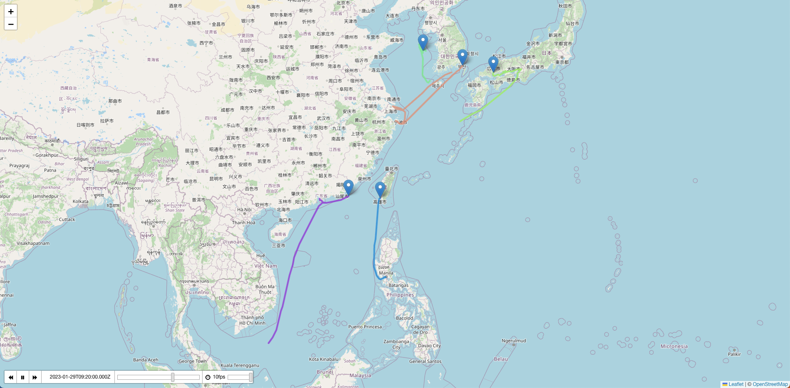

# TimeDimension

## import
```
import L from "leaflet";
import "leaflet/dist/leaflet.css";
import "leaflet-polylinedecorator";
import "leaflet-timedimension";
import "leaflet-timedimension/src/leaflet.timedimension.control.css";
import featureCollection from "@/assets/featureCollection.json";

import { Icon }  from 'leaflet'
delete Icon.Default.prototype._getIconUrl;

Icon.Default.mergeOptions({
    iconRetinaUrl: require('leaflet/dist/images/marker-icon-2x.png'),
    iconUrl: require('leaflet/dist/images/marker-icon.png'),
    shadowUrl: require('leaflet/dist/images/marker-shadow.png')
});
```
## json data
```
{
    "type": "FeatureCollection",
    "name": "replay",
    "features": [
        {
            "type": "Feature",
            "properties": {
                "name": "416037000",
                "times": ["2023-01-25 00:17", "2023-01-25 00:53",......],
                "color": "#098bd9"
            },
            "geometry": {
                "type": "LineString",
                "coordinates": [[120.92082, 14.55393667], [120.92118667, 14.55402167],....]
            }
        },....
    ]
})
```

## map setting
```
this.map = new L.map("map", {
    timeDimensionControl: true, //replay
    timeDimensionControlOptions: {
        //replay
        timeSliderDragUpdate: true,
        loopButton: false,
        autoPlay: true,
        playerOptions: {
            transitionTime: 100,
            loop: false,
            startOver: true,
        },
    },
    timeDimension: true, //replay
})
```

## timeDimension
```
timeDimension(featureCollection) {
    let startDate = new Date();
    startDate.setUTCHours(0, 0, 0, 0);

    let geoJSONLayer = L.geoJSON(featureCollection, {
        onEachFeature: function (feature, layer) {
            if (layer instanceof L.Polyline) {
                layer.setStyle({
                    color: feature.properties.color,
                    weight: "4",
                    opacity: 0.8,
                    zIndexOffset: 900,
                });
            }
            layer.bindTooltip(feature.properties.name);
        },
    });

    let geoJSONTDLayer = L.timeDimension.layer.geoJson(geoJSONLayer, {
        period: "PT2M",
        updateTimeDimensionMode: "replace",
        updateTimeDimension: true,
        addlastPoint: true,
        // waitForReady: true,
    });

    geoJSONTDLayer.addTo(this.map);
    L.polylineDecorator(geoJSONTDLayer, {
        patterns: [
            // defines a pattern of 10px-wide dashes, repeated every 20px on the line
            {
                offset: 0,
                repeat: 20,
                symbol: L.Symbol.arrowHead({
                    pixelSize: 12,
                    pathOptions: {
                        fillColor: "#e26a8c",
                        color: "#000",
                        fillOpacity: 0.8,
                        weight: 0.5,
                        stroke: true,
                    },
                }),
            },
        ],
    }).addTo(this.map);
    // this.map.setView(geoJSONLayer.getBounds(), 3);
    this.map.fitBounds(geoJSONLayer.getBounds());
},
```
